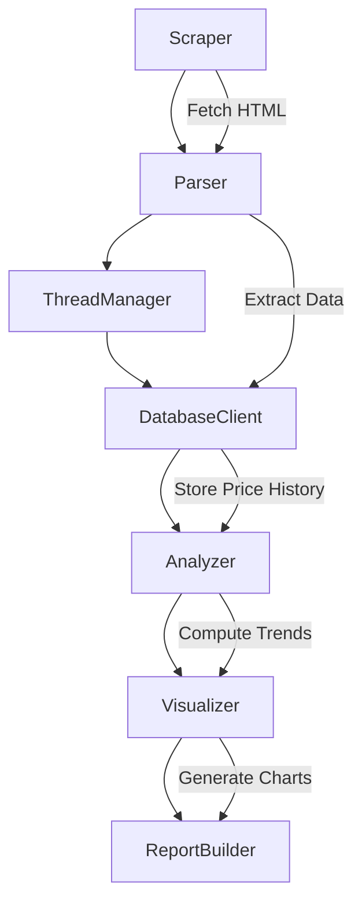
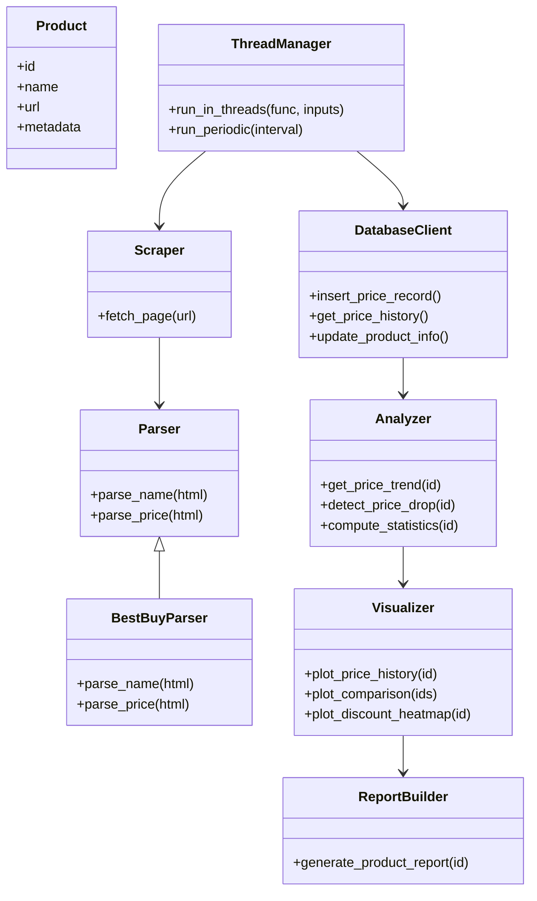
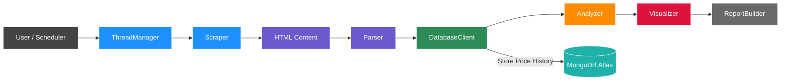

# 🛒📉 E‑Commerce Price Tracker  
### *Scrape • Store • Analyze • Visualize • Automate*

A full‑stack engineering project featuring OOP architecture, threading, cloud DB, analytics, dashboards, and PDF reporting.

## 📌 Overview

A full‑stack engineering project that:

- Scrapes product data from e‑commerce sites  
- Tracks price history in MongoDB Atlas  
- Analyzes trends using Pandas  
- Visualizes insights using Matplotlib/Seaborn/Plotly  
- Generates PDF reports using ReportLab  
- Runs automatically using a threaded scheduler  

Built using clean OOP architecture and real‑world engineering practices.

---

## 🧩 Architecture Diagram

## 🏗 Class Diagram

## 🔄 System Flow

